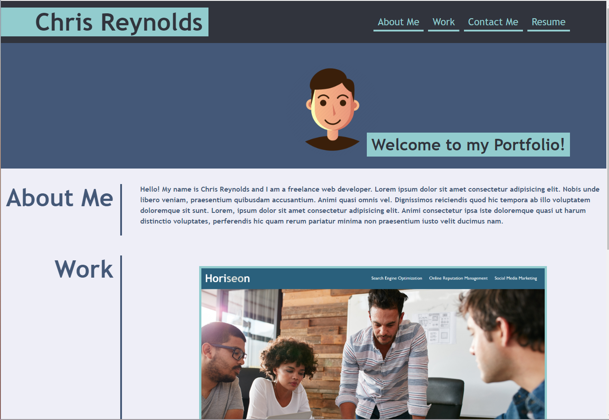

# bootcamp-portfolio
# <Bootcamp-Portfolio>

## Description
This is the first draft of my Bootcamp portfolio project.  I refactored the CSS file given in the challenge and linked it with my HTML in order to replicate the demo profile provided as closely as possible.  I look forward to adding and editing this portfolio with lots of other bootcamp projects!

## Installing
N/a

## Usage
Use the navigation bar at the top right of the page to make your way to any particular section.  

This portfolio will be my way of showing off some of my best work in the future.  Currently, I have one deployed project labeled 'Code Refactor'.  Clicking on the image will bring you to the project. 

The github link at the bottom of the page will bring you to this repo.

## Screenshot

## URL
https://chrisreynolds0508.github.io/bootcamp-portfolio/

## Authors
Chris Reynolds

## License
Please refer to the license in the repo.

